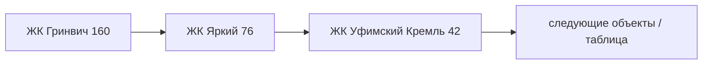

# Task canvas — РеНова+ content-prep

```mermaid
flowchart LR
  A[ЖК Гринвич 160] --> B[ЖК Яркий 76]
  B --> C[ЖК Уфимский Кремль 42]
  C --> D[следующие объекты / таблица]
```

**Status:** Гринвич + Яркий + Уфимский Кремль в каталоге (2026-11-20). Next: остальные кейсы из наполнения / таблица Карины.
